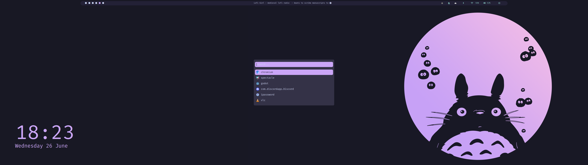
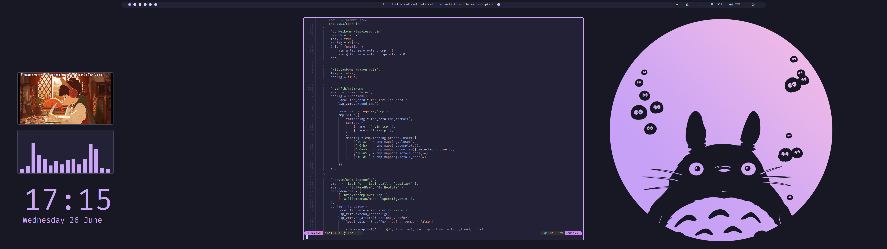
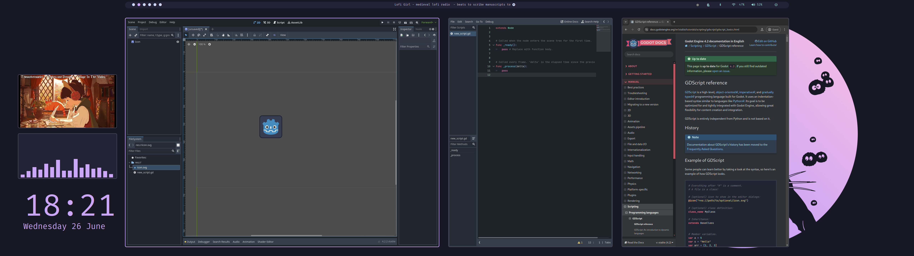

# dotfiles
Dotfiles for my 5120x1440 ultrawide setup using [bspwm](https://github.com/baskerville/bspwm).
The wallpaper is a resized version of the catppuccin totoro found in [basecamp's umakub repo](https://github.com/basecamp/omakub/blob/master/backgrounds/catppuccintotoro.png)

I use arch, btw

## Arch post-install script
I install these dots with [this post-install script](https://github.com/danielelisenberg/arch-post-install)

## Screenshots

